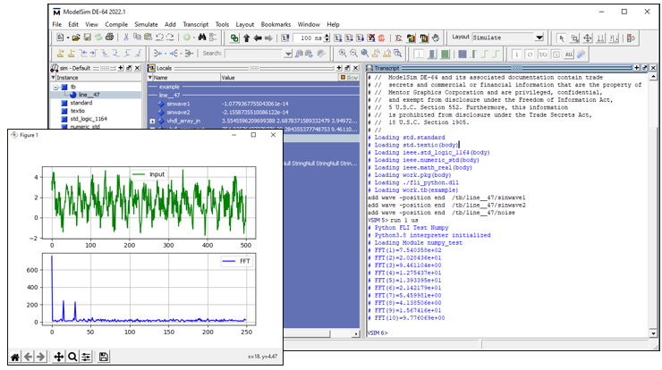
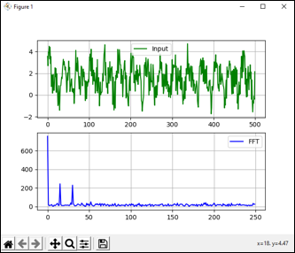

# Modelsim-Python-Demo2

Demo showing Modelsim calling the Python's **Numpy** and **Matplotlib** libraries via the Foreign Language Interface (FLI). A VHDL testbench generates 2 sine waves with some added noise, the Numpy and Matplotlib libraries are then used to calculate and display the results of an FFT. The real value results of the FFT are then passed back to the testbench.
 
    
 

Numpy and matplotlib are one of the most(?) fundamental Python packages used for scientific computing. It would be close to impossible to implement these packages in VHDL or (System)Verilog so the FLI can be used to utilized these packages for testbenches. 

   

Note this demo was created to show the capabilities of the FLI interface, there are other method available to call these packages such as the excellent [CocoTB](https://www.cocotb.org/) interface. 
 

## FLI
The **Foreign Language Interface** (FLI) is a VHDL C/C++ API used on Siemens' Modelsim and Questa simulator products. The FLI allows a C/C++ program to simulate together with VHDL (or Verilog via a wrapper), enabled a C/C++ program to traverse the hierarchy of a mixed VHDL/Verilog design, get information about and set values of VHDL/Verilog objects, get information about and control a simulation, add commands etc. The FLI is the oldest and most mature C/C++ API on Modelsim/Questa and was added during the early development years of Modelsim.
 
The FLI supports 2 modes of operations, the simpler **foreign subprogram** in which a VHDL procedure is implemented in C/C++ and a **foreign architecture** which has a VHDL architecture implemented in C/C++. A demo of the latter can be found [here](https://github.com/htminuslab/Modelsim-Unicorn). A simpler Python demo which calls a Python constraint solver can be found on this [github page](https://github.com/htminuslab/Modelsim-Python-Demo1). 
 
 

## Requirements for this demo
1) 64bits Modelsim DE (or 64bits Questa), Modelsim PE users need to install 64bits Modelsim DE (works on a PE license!)
2) Visual Studio 2019 (free community edition)
3) Python 3.8
4) Python [Numpy](https://numpy.org/) version 1.95.5
5) Python [Matplotlib](https://matplotlib.org/)
 
## Checks before building/running the demo
1) Modelsim installation root directory is set via the **MTI_HOME** environmental variable. This is required because the build file uses %MTI_HOME%/include and %MTI_HOME%/win64pe.

```
E:\Modelsim-Python-Demo2\sim>echo %MTI_HOME%
D:\Products\modelsim_de_2022
```

2) Open the **run.bat** file and correct the path to the Python include and lib directory and correct the **TCLLIBPATH** for your setup.

```
set TCLLIBPATH=C:/utils/Python38/tcl/

cl -c /Zi -I%MTI_HOME%\include -IC:\utils\Python38\include src\fli_python.c
link -dll /EXPORT:call_python_function /EXPORT:call_python_module /EXPORT:call_python_cleanup fli_python.obj %MTI_HOME%\win64pe\mtipli.lib C:\utils\Python38\libs\python38.lib /out:fli_python.dll
```
  
Note the **TCLLIBPATH**is required as by default Modelsim will use TK from the installed Modelsim version, this will fail for matplotlib as it requires the same version as supplied with the used Python version (3.8 in the demo's case).  
  
3) Open the src/fli_python.c file and correct the path to the demo directory in line 67

```C
PyRun_SimpleString("sys.path.append(r'E:\\Modelsim-Python-Demo2')"); // Change me!!
``` 

4) If required install numpy and matplotlib libraries via pip

```Python
pip install numpy
pip install matplotlib

E:\Modelsim-Python-Demo2>pip show numpy
Name: numpy
Version: 1.19.5
..snip..

E:\Modelsim-Python-Demo2>pip show matplotlib
Name: matplotlib
Version: 3.3.4
..snip..
```

5) The 64bits Visual Studio compilers are added to the search PATH.

```
call "C:\Program Files (x86)\Microsoft Visual Studio\2019\Community\VC\Auxiliary\Build\vcvarsall.bat" x86_amd64

E:\Modelsim-Python-Demo1>cl /?
Microsoft (R) C/C++ Optimizing Compiler Version 19.29.30137 for x64
Copyright (C) Microsoft Corporation.  All rights reserved.
```
 
## How does the demo work? 
 
The VHDL src/tb.vhd design contains 2 foreign procedures, **call_python_module()** and **call_python_function()**. 
 
```VHDL
procedure call_python_module(module_name:in string);
attribute FOREIGN of call_python_module : procedure is "call_python_module ./fli_python.dll";   
    
procedure call_python_function(function_name:in string; vhdl_array_in:in real_array; vhdl_array_out:out real_array);
attribute FOREIGN of call_python_function : procedure is "call_python_function ./fli_python.dll";    
``` 
 
The call_python_module() is used to load a module and call_python_function() calls a function inside the Python module. The FOREIGN attribute tells Modelsim which C function to call (call_python_module) and in which file it is located (/fli_python.dll). 

During elaboration Modelsim *binds* the 2 function calls to C functions compiled into the fli_python.dll file. When the simulator call these VHDL functions during simulation the equivalent C functions are called. In turn the two C functions are *linked* to the equivalent Python functions. In order to call the Python functions we first need to initialize the Python interpreter (*by calling Py_Initialize()*) and then load the Python module (numpy_test.py). 

The testbench (rtl/tb.vhd) start by calling the numpy_test module, during this call the Python interpreter is initialized and **numpy_test.py** called. 

```VHDL
begin  
    call_python_module("numpy_test");
``` 

The testbench then creates 2 sine waves with some noise, the amplitudes are stored in a real array (vhdl_array_in).
```VHDL
for i in 1 to 500 loop                                  -- 500 samples
    sinwave1:=sin(3.0*MATH_PI*2.0*real(i)/100.0);       -- 15Hz
    sinwave2:=sin(6.0*MATH_PI*2.0*real(i)/100.0);       -- 30Hz
    
    UNIFORM(seed1, seed2, noise);                       -- Add some noise
    vhdl_array_in(i):=sinwave1+sinwave2+noise*3.0;      -- Add to input real array
 end loop;
```
After generating the inout data the resulting vhdl_array_in real array is passed to the Python **do_fft** function via the FLI call_python_function() call:

```VHDL
call_python_function("do_fft",vhdl_array_in,vhdl_array_out);-- Calc FFT     
    wait for 100 ns;
```

Numpy will then calculate the FFT and display the results via matplotlib, the result of the FFT (real values only) are passed back to the VHDL testbench which then prints the first 10 values in the transcript window. 
 
 
## Build DLL and run the demo
To build the DLL and run the demo execute the **run.bat** file in a CMD prompt. This batch file creates the **fli_python.dll** file and invoke Modelsim. The output should be something like: 
 
``` 
E:\Modelsim-Python-Demo2>run
Microsoft (R) C/C++ Optimizing Compiler Version 19.29.30137 for x64
Copyright (C) Microsoft Corporation.  All rights reserved.

fli_python.c
Microsoft (R) Incremental Linker Version 14.29.30137.0
Copyright (C) Microsoft Corporation.  All rights reserved.

   Creating library fli_python.lib and object fli_python.exp
Reading pref.tcl

# 2022.1

# vsim -quiet -c work.tb -do "run 1 us; quit -f"
# //  ModelSim DE-64 2022.1 Jan 29 2022
# //
# //  Copyright 1991-2022 Mentor Graphics Corporation
# //  All Rights Reserved.
# //
# //  ModelSim DE-64 and its associated documentation contain trade
# //  secrets and commercial or financial information that are the property of
# //  Mentor Graphics Corporation and are privileged, confidential,
# //  and exempt from disclosure under the Freedom of Information Act,
# //  5 U.S.C. Section 552. Furthermore, this information
# //  is prohibited from disclosure under the Trade Secrets Act,
# //  18 U.S.C. Section 1905.
# //
# run 1 us
# Python FLI Test Numpy
# Python3.8 interpreter initialized
# Loading Module numpy_test
# FFT(1)=7.540358e+02
# FFT(2)=2.028436e+01
# FFT(3)=9.461104e+00
# FFT(4)=1.275437e+01
# FFT(5)=1.393395e+01
# FFT(6)=2.142179e+01
# FFT(7)=5.459981e+00
# FFT(8)=4.138506e+00
# FFT(9)=1.567416e+01
# FFT(10)=9.776069e+00
#  quit -f
# Cleaning up Python
# Calculate FFT using Numpy 1.19.5
#
# length 250 250 500
#
# Errors: 0, Warnings: 0
```
Before the values are display in the transcript window the matplotlib window will popup, it shows the 2 peaks at 15Hz and 30Hz as generated in the testbench.

    
 
 
## Notice
All logos, trademarks and graphics used herein are the property of their respective owners.

 